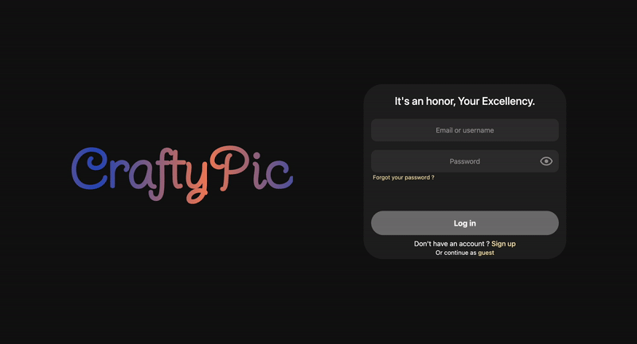
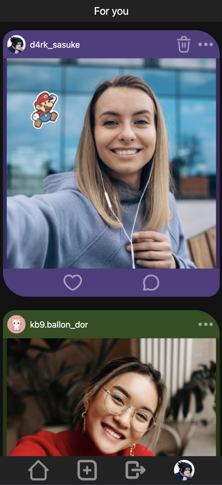

<div align="center">
	
</div>

## Description
<p align="center">
	Do you prefer Instagram or Snapchat ? It doesn't matter, because CraftyPic gathers the best of both of them !
</p>

## Local installation

- Step 1 : Install and run Docker [Documentation](https://docs.docker.com/engine/install/)

- Step 2 : Clone the project and replace the ".env-example" file extensions with ".env", as well as the "msmtprc-example" with "msmtprc". Variables are already filled, but it's recommended to replace them with your own values.

- Step 3 : On a terminal, go to the project folder and execute :
```bash
docker compose up --build
```

After building, your app will be running on localhost:8080, and Phpmyadmin on localhost:8081.
<div align="center">
	
</div>

# Features

## Gallery
<div align="center">
  
</div>
<p align="center">
	You'll find the pics uploaded by the community on the main page. After signing up and / or logging in, you'll be able to both like and comment your favorite ones. Don't hesitate to do so, as I'm sure the creator will appreciate your feedback !
</p>

## Editor

<div align="center">
	
</div>
<p align="center">
	It's now time for you to create your own pics ! Take your best selfie and bring it to life by inserting cute stickers using the editor ! =3
</p>

## Other

<table align="center">
  <tr>
    <td align="center">
      
    </td>
    <td align="center">
      
    </td>
  </tr>
  <tr>
    <td align="center">
      Comments
    </td>
    <td align="center">
      Mobile version
    </td>
  </tr>  
</table>
